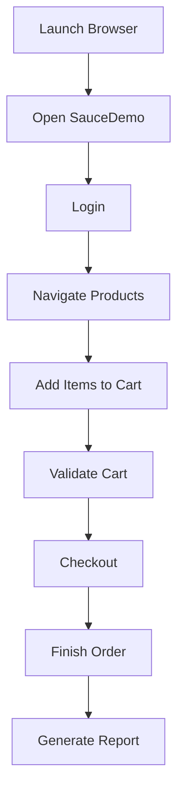

# SauceDemo UI Automation Framework

<div align="center">


<br/>
<br/>


</div>

---

# Project Overview

This project is a professional UI Automation Testing Framework developed for the SauceDemo web application using:

* Java
* Selenium WebDriver
* TestNG
* Maven
* Extent Reports
* Page Object Model (POM)

The main goal of this project is to automate real-world user journeys such as:

✅ Login Validation
✅ Error Handling Validation
✅ Product Purchase Flow
✅ Cart Validation
✅ Checkout Process
✅ End-to-End User Journey Testing

This framework follows industry-standard automation architecture and clean coding practices.

---

# What This Project Actually Tests

This automation framework validates multiple real user scenarios inside the SauceDemo application.

## Standard User Journey

The automation performs:

1. Open SauceDemo Website
2. Login with valid credentials
3. Add products to cart
4. Open cart page
5. Validate cart items
6. Complete checkout process
7. Finish order successfully

---

## Login Error Validation

The automation validates:

* Invalid login attempts
* Error message visibility
* Authentication validation behavior

---

## Glitch User Journey

This scenario validates:

* Unstable/glitch user flow
* UI synchronization handling
* Robust automation execution
* Stability of page interactions

---

# Framework Architecture

This project follows the **Page Object Model (POM)** design pattern.

## Project Structure

```bash
SauceDemoUISeleniumAutomation
│
├── src
│   ├── main
│   │   └── java
│   │       ├── config
│   │       │   └── ConfigReader.java
│   │       └── utils
│   │           └── WaitUtils.java
│   │
│   └── test
│       ├── java
│       │   ├── base
│       │   │   └── BaseTest.java
│       │   │
│       │   ├── pages
│       │   │   ├── LoginPage.java
│       │   │   ├── InventoryPage.java
│       │   │   ├── CartPage.java
│       │   │   └── CheckoutPage.java
│       │   │
│       │   └── tests
│       │       ├── StandardUserJourneyTest.java
│       │       ├── LoginErrorTest.java
│       │       └── GlitchUserJourneyTest.java
│       │
│       └── resources
│           └── config.properties
│
├── testng.xml
├── pom.xml
└── README.md
```

---

# Design Pattern Used

## Page Object Model (POM)

Each web page has its own dedicated class.

Example:

| Page          | Responsibility            |
| ------------- | ------------------------- |
| LoginPage     | Handles login actions     |
| InventoryPage | Product page interactions |
| CartPage      | Cart validations          |
| CheckoutPage  | Checkout process          |

### Why POM?

✅ Better maintainability
✅ Reusable code
✅ Cleaner architecture
✅ Easier debugging
✅ Industry-standard structure

---

# Technologies & Tools Used

| Technology         | Purpose                  |
| ------------------ | ------------------------ |
| Java 17            | Programming Language     |
| Selenium WebDriver | Browser Automation       |
| TestNG             | Test Execution Framework |
| Maven              | Dependency Management    |
| Extent Reports     | Test Reporting           |
| IntelliJ IDEA      | Development IDE          |
| ChromeDriver       | Browser Driver           |

---

# Automation Workflow



---

# Installation & Setup Guide

## Prerequisites

Before running the project, install:

* Java JDK 17
* Maven
* IntelliJ IDEA / VS Code
* Google Chrome Browser

---

## Clone Repository

```bash
git clone https://github.com/your-username/SauceDemoUISeleniumAutomation.git
```

---

## Open Project

Open the project in:

* IntelliJ IDEA
  OR
* VS Code

---

## Install Dependencies

Maven will automatically download dependencies from `pom.xml`.

To manually install:

```bash
mvn clean install
```

---

# How To Run The Project

## Run All Tests

```bash
mvn test
```

---

## Run Using TestNG XML

```bash
mvn test -DsuiteXmlFile=testng.xml
```

---

# Reporting System

This project uses **Extent Reports** for professional reporting.

After execution:

```bash
target/ExtentReport.html
```

Open the report in your browser to view:

✅ Pass/Fail status
✅ Execution details
✅ Step-by-step logs
✅ Test summary

---
## Test Execution Reports
How to add screenshots: In GitHub's web editor, open this file for editing, then drag and drop your image directly into the editor at each placeholder location. GitHub will upload and link the image automatically. Replace the placeholder tag with the generated link.


# Report 1 — Overall Suite Execution Dashboard


---
# Report 2 — Q1: Verify Locked Out User


---

# Report 3 — Q2: Standard User Journey


---

# Report 4 — Q3: Glitch User Journey


---

# Test Scenarios Covered

| Test Case           | Status |
| ------------------- | ------ |
| Valid Login         | ✅      |
| Invalid Login       | ✅      |
| Add To Cart         | ✅      |
| Cart Validation     | ✅      |
| Checkout Flow       | ✅      |
| End-to-End Purchase | ✅      |
| Error Handling      | ✅      |

---

# Key Features

* Clean Page Object Model Architecture
* Reusable Methods
* Scalable Framework Design
* Extent Reporting
* Configurable Environment
* Organized Test Structure
* Industry Standard Folder Structure
* Easy Maintenance
* Cross-Test Separation
* Professional Automation Workflow

---

# Configuration Management

The project uses:

```bash
src/test/resources/config.properties
```

This file manages:

* Base URL
* Browser Configurations
* Test Environment Settings

---

# Wait Strategy Used

The framework includes utility-based synchronization using:

```java
WaitUtils.java
```

Purpose:

✅ Avoid flaky tests
✅ Improve execution stability
✅ Handle dynamic elements properly

---

# Common Issues & Solutions

## Java Version Issue

Make sure you are using:

```bash
Java 17
```

Check version:

```bash
java -version
```

---

## Maven Dependency Issue

Reload Maven project:

```bash
mvn clean install
```

---

## ChromeDriver Issue

Update Chrome browser and driver compatibility.

---

# Future Improvements

Planned enhancements:

* Jenkins CI/CD Integration
* GitHub Actions Pipeline
* Docker Support
* Parallel Execution
* Cross-Browser Testing
* Screenshot Capture on Failure
* Allure Reporting
* Data-Driven Testing

---

# Contribution

Contributions are welcome.

You can:

* Fork the repository
* Create feature branches
* Improve framework structure
* Add advanced automation features

---

# Author

## Developed By

### Oynndrila Singh Purkayestha
B.Sc. in Software Engineering (2023–2027) 
Daffodil International University (DIU)


---

# Support

If you found this project helpful:

* Star this repository
* Share with others
* Follow for more automation projects

---

<div align="center">

## "Automation is not about replacing humans, it's about empowering quality."


</div>
